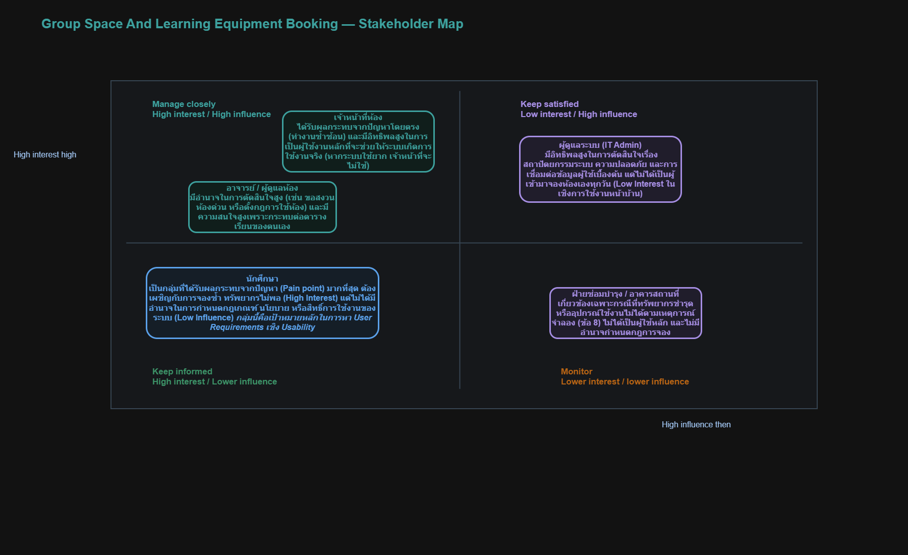
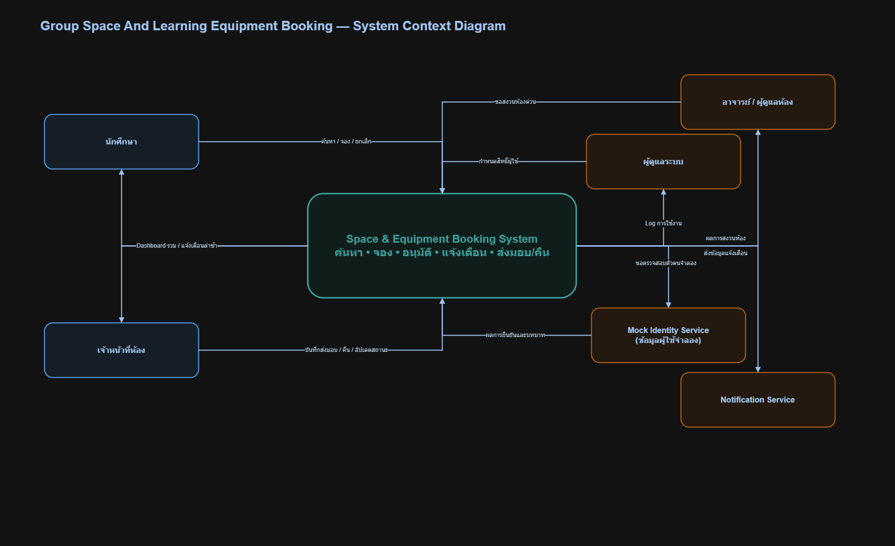

# 02 — Stakeholder, System Context and Scope

> **Week 2 deliverable**  
> เวอร์ชัน: v0.1 | สถานะ: Draft | วันที่ปรับปรุง: 18/07/2026

## 1. Stakeholder Map

| Stakeholder | Category | Needs / Goals | Influence | Engagement Approach |
| :--- | :--- | :--- | :---: | :--- |
| **นักศึกษา** | Primary User | ค้นหา ตรวจสอบสถานะ จอง และยกเลิกการใช้งานห้องหรืออุปกรณ์ด้วยตนเอง พร้อมรับการแจ้งเตือน | สูง | User Survey, Observation, Usability Testing |
| **เจ้าหน้าที่ห้อง** | Secondary User | บันทึกการส่งมอบ-รับคืนอุปกรณ์ อัปเดตสถานะการใช้งาน และติดตามการแจ้งเตือนกรณีส่งคืนล่าช้าผ่าน Dashboard | สูง | Interview, Workflow Observation |
| **อาจารย์ / ผู้ดูแลห้อง** | Key Stakeholder | ดำเนินการขอสงวนห้องแบบเร่งด่วนสำหรับการเรียนการสอนหรือกิจกรรมพิเศษ และติดตามผลการอนุมัติสงวนห้อง | ปานกลาง - สูง | Interview, Feedback Form |
| **ผู้ดูแลระบบ (System Admin)** | Administrator | จัดการกำหนดสิทธิ์ผู้ใช้งาน (Roles & Permissions) และตรวจสอบบันทึกประวัติการใช้งาน (System Logs) เพื่อความปลอดภัยและเสถียรภาพ | ปานกลาง | Technical Requirement Workshop |

## 2. System Context

ระบบ Group Space And Learning Equipment Booking System เป็นเว็บไซต์ศูนย์กลางที่เชื่อมต่อระหว่างผู้ใช้งานและผู้ดูแลระบบ
- **ผู้ใช้งาน (นักศึกษา/บุคลากร):** เข้าถึงระบบผ่าน Web Browser เพื่อส่งคำขอจองพื้นที่และอุปกรณ์ (Booking Request), ยกเลิกการจอง, และดูตารางเวลา (Calendar View) ที่สะท้อนสถานะว่างแบบ Real-time
- **ผู้ดูแลระบบ (เจ้าหน้าที่/Admin):** เข้าถึงระบบเพื่อตรวจสอบคำขอ, อนุมัติ/ปฏิเสธการจอง, และจัดการข้อมูลทรัพยากร
- **ระบบภายนอก:** ระบบทำงานเป็นเอกเทศ (Standalone) โดยไม่ได้เชื่อมต่อกับระบบสารสนเทศหลักของมหาวิทยาลัย, ระบบชำระเงิน, หรืออุปกรณ์ IoT (ตาม Scope) ข้อมูลที่เข้าออกคือข้อมูลการจัดการการจองภายในระบบเท่านั้น

## 3. Scope Statement

### In Scope

| Area | Included capability | Rationale |
|---|---|---|
| User Management | ระบบจัดการบัญชีผู้ใช้ (Authentication) แยกสิทธิ์ระหว่าง User และ Admin บนหน้าเว็บ | จาก In Scope ใน 01-problem-brief |
| Dashboard | หน้าจอเว็บไซต์ Dashboard แสดงตารางเวลา (Calendar View) ของแต่ละห้องและอุปกรณ์ | จาก In Scope ใน 01-problem-brief |
| Booking System | ระบบส่งคำขอจอง (Booking Request) และระบบยกเลิกการจองผ่านเว็บไซต์ | จาก In Scope ใน 01-problem-brief |
| Approval Workflow | หน้าต่างเว็บไซต์สำหรับ Admin ในการกดอนุมัติ (Approve) หรือปฏิเสธ (Reject) พร้อมใส่เหตุผล | จาก In Scope ใน 01-problem-brief |

### Out of Scope

| Area | Excluded capability | Reason |
|---|---|---|
| Payment | ระบบปรับเงินหรือชำระเงินออนไลน์บนหน้าเว็บ | จะใช้ระบบบันทึกคะแนนความประพฤติ/ระงับสิทธิ์ชั่วคราวแทน (จาก 01-problem-brief) |
| IoT Integration | การเชื่อมต่อกับอุปกรณ์ IOT (เช่น เซนเซอร์ตรวจจับคนในห้อง หรือปลดล็อกอัตโนมัติ) | นอกเหนือขอบเขตเบื้องต้นของโครงงานรายวิชา (จาก 01-problem-brief) |

## 4. Constraints and Business Rules

| ID | Constraint / Rule | Source | Impact |
|---|---|---|---|
| CT-01 | ใช้โจทย์เดิมตลอด Week 1–16 ห้ามเปลี่ยนแกนของ Case Project เอง | CASE_CARD.md | หากต้องการเปลี่ยนหรือเพิ่ม scope ให้ทำ Change Request |
| CT-02 | การจองอุปกรณ์การเรียนรู้จะต้องมารับและคืนที่เคาน์เตอร์ในช่วงเวลาทำการเท่านั้น | 01-problem-brief (A-02) | ระบบต้องแสดงและตรวจสอบเวลาทำการสำหรับการรับ-คืน |

## 5. Ethics, Privacy and Accessibility Considerations

- ข้อมูลส่วนบุคคลที่ระบบอาจเกี่ยวข้อง: ข้อมูลบัญชีผู้ใช้นักศึกษาและบุคลากร, ประวัติการจองและยืม-คืน, บันทึกคะแนนความประพฤติ
- ความเสี่ยงด้านสิทธิ์การเข้าถึง/ความปลอดภัย: การเข้าถึงข้อมูลการจองหรือสิทธิ์แอดมินโดยไม่ได้รับอนุญาต, ข้อมูลสูญหาย, ระบบล่ม
- การเข้าถึงสำหรับผู้ใช้หลากหลายกลุ่ม: หน้าเว็บไซต์ต้องแสดงผลได้บนมือถือและคอมพิวเตอร์ (Mobile-Friendly) และเข้าใจง่ายใช้งานได้ราบรื่นแม้เป็นผู้ใช้ครั้งแรก
- ข้อควรระวังด้านจริยธรรม: ความเป็นธรรมในการอนุมัติ/ปฏิเสธคำขอจอง, การให้เหตุผลอย่างโปร่งใส, บทลงโทษการคืนช้าที่เป็นธรรม

## 6. Baseline Scope Decision

สรุปสิ่งที่ทีมตกลงใช้เป็น baseline หลัง Week 2 และอ้างอิง decision log

ระบบ Group Space And Learning Equipment Booking System จะครอบคลุมการจองพื้นที่และอุปกรณ์ผ่านหน้าเว็บไซต์ โดยมีระบบจัดการบัญชีแยกสิทธิ์ User/Admin, Dashboard แสดงตารางเวลาแบบ Real-time เพื่อป้องกันการจองซ้ำซ้อน, และหน้าสำหรับ Admin เพื่อจัดการอนุมัติ/ปฏิเสธ ทั้งนี้ระบบจะไม่มีการชำระเงินออนไลน์และไม่มีการเชื่อมต่อกับอุปกรณ์ IOT
